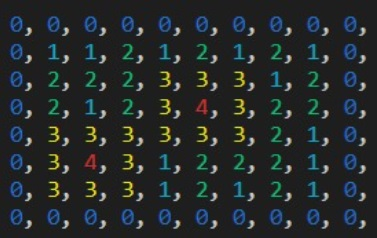
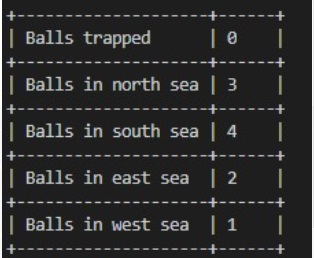

# Island in C


This is a project that uses pthreads to simulate the behaviour of balls raining in an Island.

## Island Map


## General Points
- The Map has different levels depending on the height and it has a color assigned to it.

- The colors from low to high are: blue, cyan, green, yellow, red, magenta. (Blue is the lowest, Magenta is the highest).
- In the other side we show the positions of the of the balls by printing their id


### Raining Baseballs
Each of the raining balls behavior are executed in their own thread, the data of each ball is stored in a structure which goes as follows:
```
struct ballData {
    pthread_t tid;
    long id;
    int x;
    int y;
};
```


With this we know their position, the id of the ball, and the id of the thread.

The structures of all balls are stored in a global array that is accessible for everyone, this helps us communicate between threads whenever we have a collision.

### Balls Behavior


### Final Results
There are global variables that keep track of the places where the balls landed.
The ball threads are meant to update this variables whenever they land on water, letting us know if they landed north, south, east or west of the island, also if they get stuck inside the island (this happens when all the heights around the ball are higher), they will register themselves as stuck and finish.

