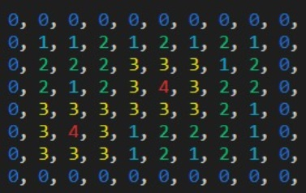
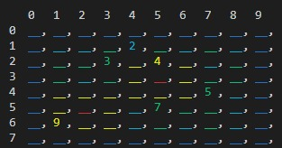
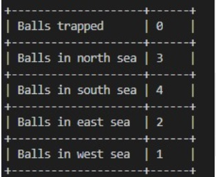

# Island 

This project is meant to be a rainig simulator of baseballs. It is a small map with variable heights and an ocean, in this small map we can create different baseballs that fall into the map and increase their speed when they get to a lower level. Each ball is implemented in a different thread which defines its behavior. The baseball falls to a lower level, if the position is free it lands without trouble, but if the spot is taken, the two balls collide and are thrown to a random spot near them ignoring if the new height is greater.



This map represents the island, it shows the levels with different colors, starting with zero, which is the ocean and has a dark blue color, all the way up to four, which represents the top of a mountain with red color.

On the next image we show the map with the positions that are taken by each ball, the blank spaces represent free spots where the balls can land.



The baseballs can land on different spots of the land, including the ocean. When a baseball lands on the ocean it is automatically destroyed, but where they land on the map they start moving down trying to reach the ocean. The balls can either land on the ocean or be trapped in the island, as there are some spots where a lower level is surrounded by higher levels only.

At the end where all the balls reach the ocean or get trapped, a little table is displayed showing all the balls that landed on the north, south, east or west ocean, also it shows the baseballs that were trapped on the island.



# Try the program!

## Compile code
```
make compile
```

## Run code
```
./island [numberOfBalls]
```